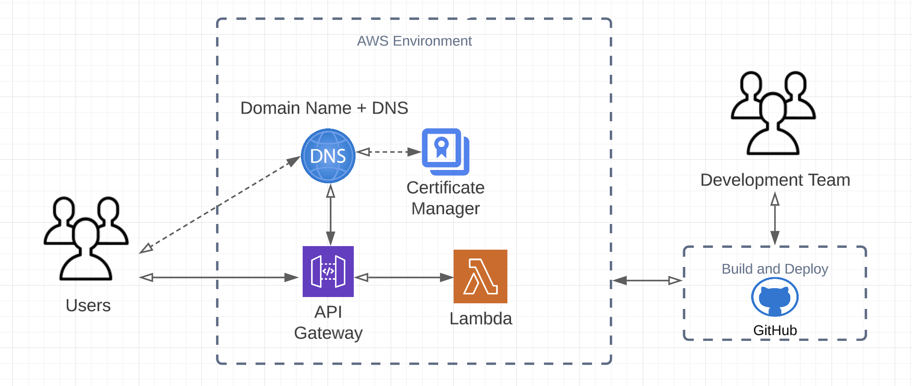

# cointracker hello world API

## Immediate Demo of Working API
```bash
curl https://xfe2ggc5xh.execute-api.us-east-1.amazonaws.com/v1/hello-world
```

Apologies I wasn't able to get DNS + Domain Name Provisioned in time to give it a better name!

### Notion document where I started taking notes
https://www.notion.so/Alex-Kuznicki-Platform-Engineer-4c08323d8b214fe18c633bd263dfd4d0

# API Design Options
Originally started documenting in Notion - couldn't copy it over to markdown.
Here is some of my assumptions/thoughts about this project and why I chose what I did.


## Design Choice:

Based on the options laid out above I will choose to go with a **Serverless Function** implementation for the main reasons:

- This is a demo “hello world” API with expected low volume of traffic and unpredictable
- Less components involved which given an asked 4 hour upper limit on the project it will allow for developing the End-End solution first to get an MVP working.
    - If time allows we can expand to a more cost effective solution if we assume the API will receive higher levels of traffic. Could **Dockerize** a **REST AP**I or **gRPC API** and deploy it


# Components Covered in this Demo Project

- Organized Terraform to manage infrastructure (to accommodate multiple environments)
- Github Actions pipeline to automatically build and deploy terraform to AWS
- Github Actions pipeline to automatically build and deploy Go code to AWS to serve API traffic
- API Gateway configured with route to lambda function
- AWS Lambda Function as deployable artifact (Go executable)
- IAM Role for Github Actions to allow minimum deployment privileges



# Current Deployment steps
1. create a branch prefixed with feature/
2. Make changes to terraform or Go API func
3. Push changes
4. Enjoy deployment
5. Merge your changes to main when done


# Small Todo + Improvements
- abstract deployment pipeline to allow for deploying to different environments
- Make Github actions pipeline use IAM role to get temp credentials instead of keys from Env var
- Route53 Domain Name + ACM Certificate
- Restrict API traffic with API Key + configure throttling
- Request Latency + Error monitoring
- Implement some centralizd logging


# Setup from Scratch Steps (if building in a new AWS account or environment)

Step 0. Be in the AWS Account of the environment to set this up (Dev, Stg, Prd, etc..)
Step 1. Provision a Temporary User
Step 2. Provision Yourself Temporary AWS Secret Keys locally and destroy after use. 
These steps are only required to be ran once per environment. From then on the Github Actions
Pipeline will do all the deployment to AWS Environments.

# Preliminary Resources Required

### DynamoDB State Lock Table

Example:
```bash
aws dynamodb create-table \
  --table-name terraform-state-lock \
  --attribute-definitions AttributeName=LockID,AttributeType=S \
  --key-schema AttributeName=LockID,KeyType=HASH \
  --provisioned-throughput ReadCapacityUnits=5,WriteCapacityUnits=5 \
  --tags Key=Environment,Value=development
```

### S3 State File Bucket
Replace bucket name - and configure the same bucket name in the terraform workspaces environment providers file.

Example:
```bash
aws s3api put-bucket-versioning \
  --bucket ct-ak-api-us-east-1-tf-state \
  --versioning-configuration Status=Enabled
```

## Deploying First Steps on CICD
1. You'll need to first deploy the terraform by deploying the code to github and running the TF pipeline
2. Run the code pipeline after it assumes the lambda func is there already


